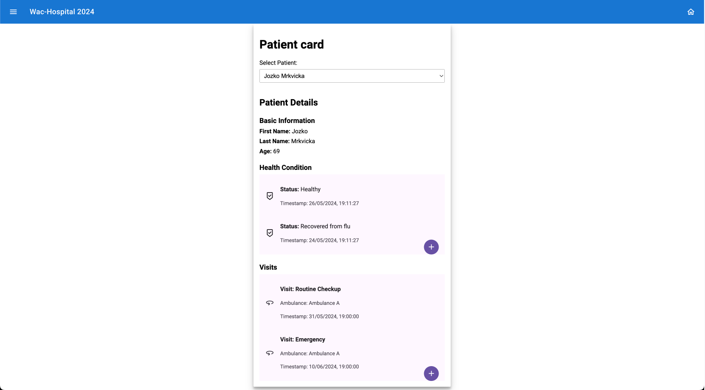

# Karta Pacienta

## Mená členov "tímu"

- **Bc. Dominik Šalgovič**

## Téma projektu a Prípady použitia

Portál pre pacientov, na ktorom môžu získať prehľad o svojich chorobách a uskutočnených ako aj plánovaných návštevách

 - Ako pacient chcem mať možnosť zobraziť svoju kartu pacienta **(Read)** a získať tak prehľad o svojich návštevách. 
 - Chcem mať možnosť nahlásiť svoj aktuálny zdravotný stav **(Create)**. 
 - Chcem mať možnosť zmeniť **(Update)** alebo zmazať **(Delete)** vybrané detaily návštev.

## Stručný opis riešenia

- **Karty pacientov**: V databáze sa nachádzajú dvaja pacienti - je možné zvoliť pacienta a zobraziť údaje svojej karty
- **Zdravotné stavy**: Pacienti možu do svojej karty pridať záznam o dvojom akruálnom zdravotnom stave.
- **Zaznamenávanie návštev**: Možnosť zobrazenia návštev pacientov s dátumom, časom a dôvodom - možnosť požiadať o novú návštevu, zmazať zázanm o návšteve, alebo upraviť ich podrobnosti
- **Použitie 3 komponentov**: V rámci riešenia boli vytvorené 3 stencil komponenty ktoré medzi sebou komunikujú údaje o pacientoch a ich návštevách - v databáze údaje uložené do dvoch kolekcií.
- **Funkčnosť implementácie**: Aplikácia je plne funkčná a neobsahuje žiadne bugy - všetko sú features ;)

## Názov aplikácie na spoločnom klastri
#### Karta pacienta
Zobrazí detail karty pacienta - xsalgovic

## Odkazy na repozitáre

- **Frontend Repozitár**: [WAC Patient FE](https://github.com/Salgac/wac-patient-fe)
- **Backend Repozitár**: [WAC Patient BE](https://github.com/Salgac/wac-patient-be)
- **GitOps Repozitár**: [WAC Patient GitOps](https://github.com/Salgac/wac-patient-gitops)

## DockerHub Registry

- **DockerHub Registry**: [Salgac Repositories](https://hub.docker.com/repositories/salgac)

## Aplikácia na spoločnom klastri

- **Frontend Aplikácia URL**: [Karta Pacienta](https://wac-24.westeurope.cloudapp.azure.com/ui/xsalgovic-patient-card/)

## Názvy deployment objektov

- **UI Deployment**: `xsalgovic-patient-fe`
- **Web API Deployment**: `xsalgovic-patient-webapi`

## Nasadenie na Azure Cloud

- **Azure Cloud Nasadenie**: [Patient Card](https://xsalgovic-patient.azurewebsites.net/)
